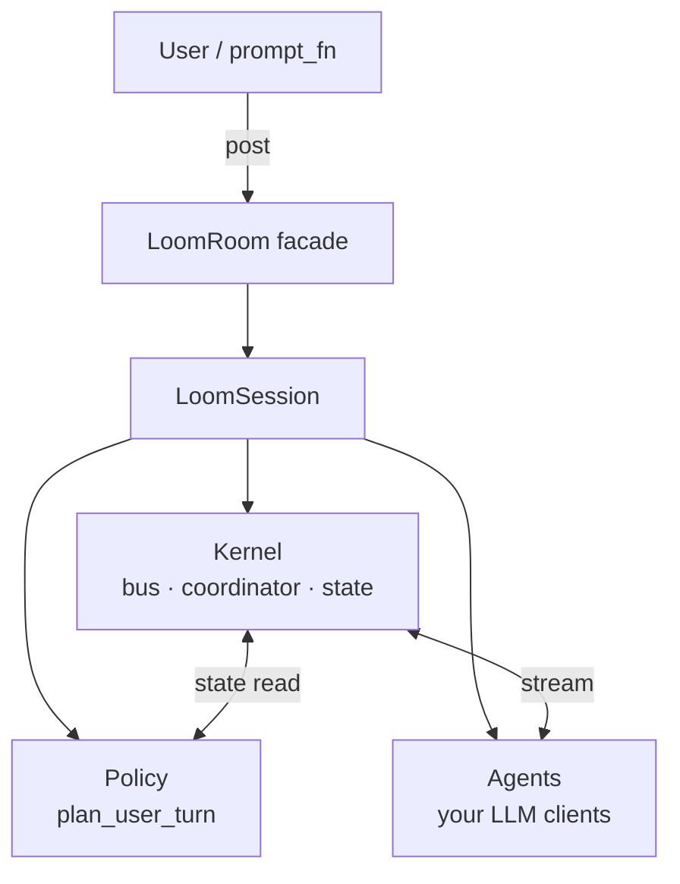

<div align="center">

# 🪡 Loom

**A small, opinionated kernel for multi-agent LLM chatrooms.**
_Race-free turn taking. Pluggable policies. Bring your own LLM SDK._

[](https://github.com/hdubey-debug/loom/actions/workflows/ci.yml)
[](https://www.python.org/)
[](LICENSE)
[](https://github.com/astral-sh/ruff)
[](#)
[](https://colab.research.google.com/github/hdubey-debug/loom/blob/main/examples/colab_demo.ipynb)

</div>

<!-- DEMO GIF: docs/demo.gif (placeholder — record after a public release) -->

Loom is a small library for building multi-agent chatrooms. You provide
a list of agents and (optionally) a routing policy; Loom runs the room.
Race conditions, cursor drift, obligation tracking, mention routing,
prompt sandboxing, and streaming consolidation are the kernel's job —
not yours.

It's the substrate behind [Weave](https://github.com/hdubey-debug/weave),
a terminal multi-agent console. Loom is intended to be reusable for
any LLM-driven chatroom: debate, classroom, 20-questions, a synthesis
council over a corpus, a peer review pair, or whatever else.

## Why Loom?

Most multi-agent code dies in three places: the cursor race when two
agents wake at once, mention parsing that quietly drops valid
addresses, and policy logic tangled with bus posting until nothing is
safe to change. Loom makes those three things the kernel's job and
gives policies one tiny pure callback (`plan_user_turn`). The result:
~5k LOC, 1170+ tests, and a public surface you can read in an hour.

| | Loom | LangGraph | AutoGen | crewAI |
|---|---|---|---|---|
| **Scope** | Kernel only | Framework | Framework | Framework |
| **LLM coupling** | Bring your own SDK | Provider-agnostic | Provider-agnostic | OpenAI-first |
| **Race-safe turn taking** | ✅ obligation + lease | DAG-level | n/a | n/a |
| **Policy as pure callback** | ✅ enforced via boundary test | partial | n/a | n/a |
| **Streaming** | ✅ delta-merged | ✅ | partial | ✅ |
| **Built-in journal** | ✅ append-only `events.jsonl` | partial | ❌ | ❌ |

_Numbers are approximate; corrections welcome via issue or PR._

## 30-second start

```python
from loom import LoomRoom, agent_from_send, OpenChatPolicy

# Each agent only needs an id + a callable that takes a prompt and
# returns text. Provider SDK calls fit cleanly here.
def gpt_send(prompt):    ...   # call OpenAI; return string
def claude_send(prompt): ...   # call Anthropic; return string

room = LoomRoom(
    agents=[
        agent_from_send("gpt",    gpt_send),
        agent_from_send("claude", claude_send),
    ],
    policy=OpenChatPolicy(),
    topic="design review",
)

with room:
    replies = room.post_and_wait("what do you think of this plan?")
    for ev in replies:
        print(f"{ev.sender}: {ev.body}")

    # Membership is dynamic.
    room.add_agent(agent_from_send("gemma", gemma_send))
    room.remove_agent("gpt")
```

`run_console()` works too — interactive REPL with stdlib defaults:

```python
with room:
    room.run_console()   # blocks; type messages, /quit to exit
```

## Mental model



<details>
<summary>ASCII fallback</summary>

```
+---------------------------------------------------------------+
| LoomRoom (facade)                                              |
|   .post / .post_and_wait / .add_agent / .remove_agent / ...  |
+----------------------------+----------------------------------+
                             |
                             v
+----------------------------+----------------------------------+
| LoomSession (build_loom_session) — actor pool + journal        |
+----------------------------+----------------------------------+
            |                 |                  |
            v                 v                  v
       +---------+      +-----------+      +-----------+
       | Kernel  |<---> |  Policy   |      |  Agents   |
       | (bus,   |      | (routing) |      | (proxies) |
       |  coord, |      +-----------+      +-----------+
       |  state) |
       +---------+
```

</details>

- **Agents** wrap your LLM calls. Use the bundled adapters
  (`agent_from_send` / `agent_from_stream` / `agent_from_object`) or
  pass any object that satisfies the `Agent` protocol — `id` plus
  `stream(prompt) -> Iterator[str]`.
- **The kernel** owns the mutable state (`RoomState`), the event bus,
  and the coordinator (leases, obligations, slot resolution, watchdog).
  It's the only mutator. Policies and rooms read from it but never
  write.
- **The policy** decides who speaks. It's a single `plan_user_turn`
  callback that returns a `UserTurnPlan` (a small dataclass naming the
  required participants, the rotation, the floor, etc.). Policies must
  be pure: no I/O, no mutation, no bus posting. The kernel watchdog
  flags anything taking >100ms.
- **`LoomRoom`** is the public-facing facade. It glues the above
  together and exposes a small, opinionated surface.

## Bundled policies

| Policy | Behavior |
|---|---|
| `DefaultPolicy` | Loom's v0 floor-aware classifier: direct mention, vocative, acknowledgement, floor-narrowed, game-start round-robin, broadcast. |
| `OpenChatPolicy` | Broadcast every user post to every active capable participant. |
| `SingleResponderPolicy(id)` | Always route to one configured participant. |
| `RoundRobinPolicy(order)` | Rotate through a fixed order, one speaker per user post. |

Pick one and pass it via `policy=...`. To write your own, see
"Writing a policy" below.

## Writing an agent adapter

The `Agent` protocol is structural — anything with `id: str` and
`stream(prompt) -> Iterator[str]` qualifies. The three helpers cover
common shapes:

```python
from loom import agent_from_send, agent_from_stream, agent_from_object

# Most LLM SDKs are non-streaming send/recv:
gpt = agent_from_send("gpt", lambda prompt: openai_chat(prompt))

# If you already have a streaming generator:
def claude_stream(prompt):
    for delta in anthropic_messages_stream(prompt):
        yield delta.text

claude = agent_from_stream("claude", claude_stream)

# Or wrap an existing client object that has .stream / .send:
my_client = MyChatClient(api_key=...)
gemma = agent_from_object("gemma", my_client,
                          persona="local 27B model",
                          cost_tier=0)
```

You can also write a class directly:

```python
class MyAgent:
    id = "mine"
    persona = "research assistant"
    capability_block = "tool use, web fetch"
    cost_tier = 2

    def stream(self, prompt):
        for chunk in my_provider.stream(prompt):
            yield chunk

room = LoomRoom(agents=[MyAgent()])
```

Optional metadata attributes (`persona`, `capability_block`,
`cost_tier`, `capable`) are read by the room when wiring; absent
attributes fall back to the documented defaults (empty strings, tier 1,
capable=True).

## Writing a policy

A policy is a subclass of `ConversationPolicy` with one required
method:

```python
from loom import ConversationPolicy
from loom.kernel.obligations import (
    plan_for_acknowledgement,
    plan_for_default,
    plan_with_required,
)

class MyPolicy(ConversationPolicy):
    name = "mine"

    def plan_user_turn(self, user_event, state, *, prior_speaker=None):
        # Inspect user_event.body and state.participants. Return one of:
        # - plan_for_acknowledgement(...)  — no turn opens.
        # - plan_for_default(pid, ...)     — single responder.
        # - plan_with_required([...], ...) — broadcast or floor-narrowed.
        active = sorted(p for p, info in state.participants.items()
                        if info.active and info.capable)
        return plan_with_required(active, routing_case="multi_opinion",
                                  reason="custom", target_event_ids=[user_event.id])
```

Look at `loom/policy/round_robin.py` for the canonical reference of
declarative state mutation (`set_turn_taking_mode`, `set_turn_order`,
`advance_turn_pointer` on the returned plan). Look at
`loom/policy/default.py` for a richer classifier with addressing
detection.

The policy contract is intentionally narrow:

- `plan_user_turn` must be **synchronous, deterministic, fast**
  (<10ms typical). The kernel holds its lock across this call to keep
  the actor-cursor race shut. Slow policies trip a `policy_slow`
  control event at ~100ms.
- A raised exception emits `policy_error` and dispatches on
  `policy_error_mode`: `"close_turn"` (default; fail-closed),
  `"default_responder"` (fall back), or `"raise"` (dev mode).
- **Policies must not mutate `RoomState` and must not post to the
  bus** — both are the kernel's responsibility. Declarative requests
  go on the returned `UserTurnPlan` (`set_turn_taking_mode`,
  `set_turn_order`, `set_floor_owner`, `wait_for_user_after`, etc.).
  A boundary test enforces this with a static grep.

`system_prompt(actor_id, state)` and `role_prompt(actor_id, state)`
are optional overrides. They contribute extra prompt sections after
the kernel charter. The charter is rendered immediately after the
`<<<SYSTEM PREAMBLE>>>` header — before persona, participant id, and
topic — and cannot be removed by a policy.

## Threading model

- Each agent runs on its own daemon thread. They wake on bus events,
  evaluate priority triggers, acquire a lease from the coordinator,
  and stream into the bus.
- `prompt_fn` runs on the main thread (typically the caller of
  `room.run_console`).
- `notify` is called from agent threads concurrently. The default
  `notify` wraps `print` in a module-level lock so streamed output
  doesn't shear; if you supply your own (e.g. a rich console renderer),
  make sure it's thread-safe.
- `room.start` / `room.stop` are idempotent and safe.
  `room.add_agent` / `room.remove_agent` serialize through a session
  lock so concurrent membership changes don't race.

## Persistence

Pass `journal_dir=...` to record an audit trail:

```python
room = LoomRoom(agents=[...], journal_dir="/tmp/my-room")
```

The journal writes:

- `events.jsonl` — append-only ledger of every bus event. Authoritative.
- `room_state.json` — fast-resume snapshot. Advisory; rebuilt from
  `events.jsonl` on a missing or corrupt snapshot.

Both files are written for audit + tooling-grade replay
(`Journal.replay_into(coord)` and `Journal.restore_state(...)` work
in tests). **Automatic restart-recovery wiring is not in v0.1.x** —
`build_loom_session` constructs a fresh `RoomState` and does not call
the recovery helpers; the journal is purely an audit log at runtime.
Wiring auto-restore lands in v0.2.

**Policy state is not journaled in v0** — restart instantiates a
fresh policy. Stateful policies (debate phase, 20Q question count)
work in-process but reset across restart. Lifecycle hooks for policy
snapshot/restore are on the v0.2 list.

## Public surface

```python
from loom import (
    # Primary surface.
    LoomRoom, Agent,
    agent_from_send, agent_from_stream, agent_from_object,
    ConversationPolicy, DefaultPolicy,
    OpenChatPolicy, SingleResponderPolicy, RoundRobinPolicy,
    RoomConfig,

    # Advanced surface (kept for power users).
    ParticipantWiring, SendProxyAdapter,
    build_loom_session, run_loom_console,
)
```

Everything else (the kernel internals under `loom.kernel.*`) is
implementation detail and may shift between minor versions.

## v0 limitations

- No async / off-lock policies (planned for v0.2).
- No policy state persistence across restart.
- No automatic restart-recovery from the journal (planned for v0.2).
  `events.jsonl` and `room_state.json` are written but
  `build_loom_session` does not currently call `replay_into` /
  `restore_state` on startup.
- `max_responses` is enforced at lease-grant time as of v0.1.2 (the
  coordinator counts already-committed drafts plus outstanding valid
  leases for the turn). v0.1.0 / v0.1.1 had a race window where two
  actors waking on the same trigger could both commit before the cap
  was checked.
- Dead-letter rerouting transfers required obligations to a fallback
  agent (default-responder slot, then cheapest active capable) in
  v0.1.2 — the rerouted agent has a real obligation to drive the
  draft. v0.1.0 / v0.1.1 emitted only a `dead_letter` trace event;
  the turn closed without a re-answer if the removed agent held the
  last unresolved required obligation.
- Stream deltas are flushed during the streaming loop, before the
  post-stream chair-speak / idle-dup / PASS filters run. UI renderers
  should clear pending text on `stream_end(status="suppressed")`
  rather than treating already-rendered deltas as the final reply.
- No per-message rate limiting or per-participant cost budgets in the
  public API. The kernel has the hooks; the room facade doesn't expose
  them yet.
- `RoomStateView` is shallow — `participants` and `control.roles` are
  read-only mappings, `control.turn_order` and `floor_owner` are
  tuples, and the view itself is a frozen dataclass. Leaf-level
  mutation (`participant_info.active = False` through a captured
  alias) is still possible; full deep-freeze with `ParticipantInfoView`
  is on the v0.2 list.
- No standalone PyPI package. Install in-place from source.

## Examples

The [`examples/`](examples/) directory has runnable scripts:

| File | What it shows |
|---|---|
| [`two_agents.py`](examples/two_agents.py) | Two scripted agents on `OpenChatPolicy`. No API key needed. |
| [`openai_two_agents.py`](examples/openai_two_agents.py) | Two real OpenAI-backed agents on `OpenChatPolicy`. Requires `OPENAI_API_KEY`. |
| [`round_robin_classroom.py`](examples/round_robin_classroom.py) | Three scripted agents on `RoundRobinPolicy` with a teacher/student handoff. |
| [`single_responder_qa.py`](examples/single_responder_qa.py) | One agent on `SingleResponderPolicy`. The minimal Q&A skeleton. |

Run any of them straight from the repo root after `pip install -e .`:

```bash
python examples/two_agents.py
```

## Roadmap

The "v0 limitations" above are the v0.2 work list:

- Async / off-lock policies for slow planning logic.
- Policy-state snapshot/restore lifecycle hooks.
- Automatic restart-recovery wiring from the journal.
- Deep-frozen `RoomStateView` to remove leaf-level mutation paths.
- Per-message rate limiting + per-participant cost budgets in the
  public API.
- Standalone PyPI package.

## License

[MIT](LICENSE) — © 2026 Harsh Dubey.

See [`CHANGELOG.md`](CHANGELOG.md) for release notes,
[`CONTRIBUTING.md`](CONTRIBUTING.md) for setup + the policy contract,
and [`docs/`](docs/) for tutorials.
