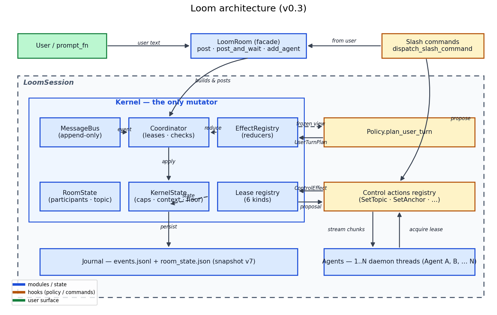
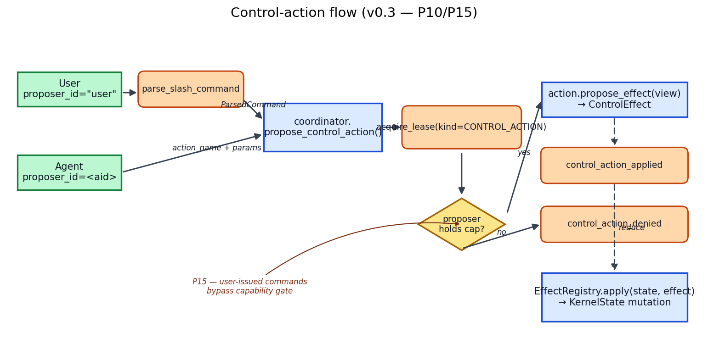
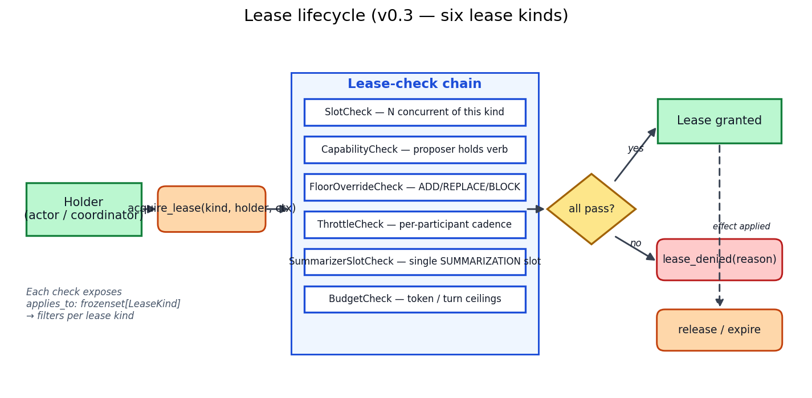
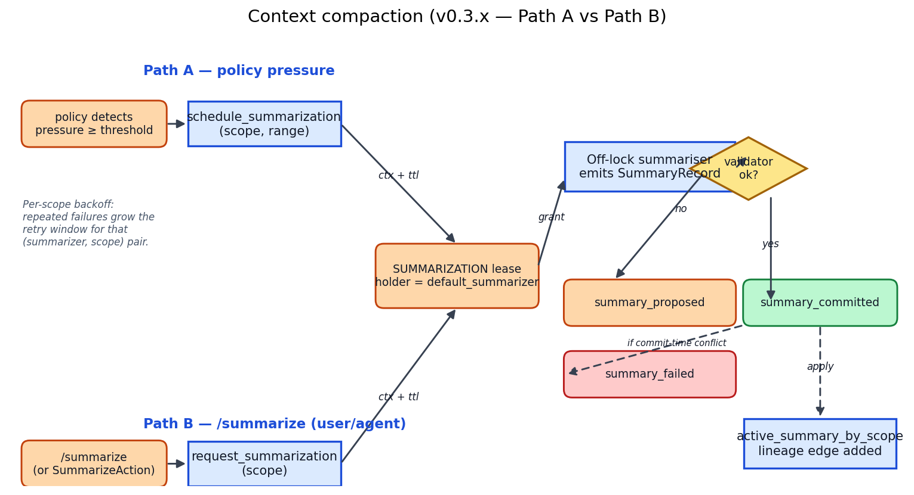

<div align="center">

# 🪡 Loom

**A small, opinionated kernel for multi-agent LLM chatrooms.**
_Race-free turn taking. Pluggable policies. Bring your own LLM SDK._
_v0.3 ships the kernel doctrine — capabilities, control actions, leases, context compaction._

[](https://github.com/hdubey-debug/loom/actions/workflows/ci.yml)
[](https://www.python.org/)
[](LICENSE)
[](https://github.com/astral-sh/ruff)
[](#)
[](CHANGELOG.md)
[](https://colab.research.google.com/github/hdubey-debug/loom/blob/main/examples/colab_demo.ipynb)

</div>

<!-- DEMO GIF: docs/demo.gif (placeholder — record after a public release) -->

Loom is a **kernel** for multi-agent LLM chatrooms. You bring agents
and (optionally) a routing policy; Loom owns the hard parts — the
cursor race when two agents wake at once, lease-gated turn taking,
mention routing, prompt sandboxing, streaming consolidation, and (as
of v0.3) a typed capability registry, control-action pipeline, and
rolling context compaction. The public surface is small enough to
read in an hour; the kernel is small enough to fork.

It's the substrate behind [Weave](https://github.com/hdubey-debug/weave),
a terminal multi-agent console. Loom is intended to be reusable for
any LLM-driven chatroom: debate, classroom, 20-questions, a synthesis
council over a corpus, a peer review pair, or whatever else.

## Table of contents

1. [Why Loom?](#-why-loom)
2. [Architecture](#-architecture)
3. [What's new in v0.3](#-whats-new-in-v03)
4. [30-second start](#%EF%B8%8F-30-second-start)
5. [Core concepts](#-core-concepts)
6. [Bundled policies](#-bundled-policies)
7. [Writing an agent adapter](#%EF%B8%8F-writing-an-agent-adapter)
8. [Writing a policy](#%EF%B8%8F-writing-a-policy)
9. [Capabilities + Control Actions](#-capabilities--control-actions)
10. [Leases](#-leases)
11. [Slash commands](#-slash-commands)
12. [Context compaction](#-context-compaction)
13. [Threading model](#-threading-model)
14. [Persistence](#-persistence)
15. [Public surface](#-public-surface)
16. [v0 limitations](#-v0-limitations)
17. [Examples + Colab](#-examples--colab)
18. [Roadmap](#%EF%B8%8F-roadmap)
19. [Contributing](#-contributing)
20. [License](#-license)

## 🎯 Why Loom?

Most multi-agent code dies in three places: the cursor race when two
agents wake at once, mention parsing that quietly drops valid
addresses, and policy logic tangled with bus posting until nothing is
safe to change. Loom makes those three things the kernel's job and
gives policies one tiny pure callback (`plan_user_turn`). The result:
~5k LOC, 1500+ tests, and a public surface you can read in an hour.

| | Loom | LangGraph | AutoGen | crewAI |
|---|---|---|---|---|
| **Scope** | Kernel only | Framework | Framework | Framework |
| **LLM coupling** | Bring your own SDK | Provider-agnostic | Provider-agnostic | OpenAI-first |
| **Race-safe turn taking** | ✅ obligation + lease | DAG-level | n/a | n/a |
| **Policy as pure callback** | ✅ enforced via boundary test | partial | n/a | n/a |
| **Streaming** | ✅ delta-merged | ✅ | partial | ✅ |
| **Built-in journal** | ✅ append-only `events.jsonl` | partial | ❌ | ❌ |
| **Typed capability registry** | ✅ 33 verbs, grant/revoke/expire | ❌ | ❌ | ❌ |
| **Control-action pipeline** | ✅ proposed → applied → reduced | ❌ | ❌ | ❌ |
| **Context compaction** | ✅ rolling, lineage, per-scope backoff | n/a | partial | ❌ |

_Numbers are approximate; corrections welcome via issue or PR._

## 🏗 Architecture



The diagram (full source in [`docs/diagrams/_render.py`](docs/diagrams/_render.py)) shows the
six places state lives and the four extension points that
contribute to it. **Layers, top to bottom:**

- **User / prompt_fn** — your application driver. Posts text or
  dispatches slash commands.
- **LoomRoom (facade)** — what your application code calls. Builds a
  `LoomSession`, wires actor threads, exposes `post`, `post_and_wait`,
  `add_agent`, `remove_agent`, `run_console`.
- **Kernel** — the only mutator. Owns `MessageBus`, `Coordinator`
  (lease checks + obligation tracking), `RoomState` + `KernelState`
  (participants, topic, capabilities, context, floor), the
  `EffectRegistry` (versioned reducers for every control effect), and
  the `Lease registry` (six lease kinds, see below).
- **Policy** — `plan_user_turn(state, user_event)` → `UserTurnPlan`.
  Pure callback, runs under the coordinator's lock, must be
  fast (<10ms typical) and side-effect free.
- **Control actions** — registry of typed state mutations
  (`SET_TOPIC`, `SET_ANCHOR`, etc.). Every kernel state change goes
  through the same `propose → lease → effect → reduce` pipeline so
  replay is deterministic.
- **Agents** — your LLM clients. Each runs on its own daemon thread,
  acquires a USER_TURN lease, streams replies into the bus.

The kernel never imports a policy; policies and agents never mutate
kernel state. The boundary is enforced by a static grep test and
exercised by 1500+ unit + property + system tests.

## 📰 What's new in v0.3

A chronological view of the last three releases. Doctrine docs in
[`docs/internal/study/`](docs/internal/study/) capture the design
dialogue behind each item.

### **v0.3.0 + v0.3.x** — kernel doctrine (22 principles)

The big v0.3 release. Every state mutation now flows through one
typed pipeline. Both subsystems below converge on the same lease
machinery so replay is deterministic regardless of trigger.

- 🔑 **Typed capability registry** (33 verbs) — grant / revoke /
  expire as first-class effects. Meta-verbs (`GRANT_CAPABILITY_X`)
  let policies delegate authority recursively.
- 🎬 **Control actions** — proposal → CONTROL_ACTION lease → effect
  → registered reducer. `SET_TOPIC`, `SET_ANCHOR`,
  `SET_DEFAULT_RESPONDER`, `SET_ROLES`, `SET_STYLE` ship in v0.3;
  `GRANT_CAPABILITY`, `SWITCH_POLICY`, `SEND_DM` queued for v0.4.
- 🪢 **Unified `Lease` abstraction** with `LeaseKind` discriminator
  (USER_TURN, REACTIVE, CONTROL_ACTION, TOOL_INVOCATION,
  WORKFLOW_STEP, SUMMARIZATION). Each check exposes `applies_to`
  so it filters per kind.
- 🗜 **Context compaction (v0.3.x)** — rolling, lineage-preserving
  summarisation with a dedicated SUMMARIZATION lease, three typed
  events, off-lock pre-validation + under-lock anchor commit,
  per-scope backoff. Two trigger paths (policy pressure vs
  `/summarize`) converge on the same lease.
- 🚪 **Floor overrides** — `ADD`/`REPLACE`/`BLOCK` modes scoped to
  one lease, the current turn, until-cleared, or persistent.
- 📜 **Slash commands** — `/grant /revoke /topic /anchor /responder
  /floor /policy /summarize` as the human-root-action surface
  (P15: user-issued commands bypass the agent capability gate).
- 💾 **Snapshot schema v7** — envelope wraps room + capabilities +
  budget + actors + context slots. Old v3–v6 snapshots migrate
  cleanly.

### **v0.2.0** — refactor program (12 PRs)

- Deep-frozen `ParticipantInfoView` (closes the soft-leak in
  `RoomStateView.participants`).
- `_KernelAuth` token gates `MessageBus.post_internal`.
- Removed `turn_taking_mode` / `floor_owner` from kernel state.
  Round-robin signalled by a non-empty `turn_order`.
- Optional policy hooks: `charter_text`, `dead_letter_target`,
  `should_post_response`, `prompt_sections`.
- Pluggable `RoomConfig.lease_checks` with structured `lease_denied`
  events. Pluggable `RoomConfig.trigger_priority`.
- Bus subscriber fan-out runs outside the bus lock — slow
  subscribers no longer block readers/writers.

### **v0.1.2** — initial public release.

## ✈️ 30-second start

The smallest end-to-end Loom application — two agents, a built-in
policy, one user post:

```python
from loom import LoomRoom, agent_from_send, OpenChatPolicy

# Each agent needs an id + a callable that takes a prompt and
# returns text. Provider SDK calls fit cleanly here.
def gpt_send(prompt):    ...   # call OpenAI; return string
def claude_send(prompt): ...   # call Anthropic; return string

room = LoomRoom(
    agents=[
        agent_from_send("gpt",    gpt_send),
        agent_from_send("claude", claude_send),
    ],
    policy=OpenChatPolicy(),
    topic="design review",
)

with room:
    result = room.post_and_wait("what do you think of this plan?")
    for m in result.messages:
        print(f"{m.sender}: {m.body}")
```

`run_console()` works too — interactive REPL with stdlib defaults:

```python
with room:
    room.run_console()   # blocks; type messages, /quit to exit
```

### …and the same room, with v0.3 surfaces

The chat loop above is the v0.1 starter. The block below exercises
the v0.3 subsystems on the same `LoomSession`:

```python
from loom.slash_commands import dispatch_slash_command
from loom.kernel.room import ParticipantInfo

with room:
    coord = room._session.coordinator

    # Register the user pseudo-participant so /-commands work.
    coord.register_participant(ParticipantInfo(id="user", capable=False))

    # P15: user-issued slash commands bypass the agent capability
    # gate. Topic flips immediately.
    dispatch_slash_command(coord, "/topic recursion lesson")
    print(room.topic)  # 'recursion lesson'

    # Compact the room's view (Path B summarisation).
    dispatch_slash_command(coord, "/summarize")

    # Propose a control action *as an agent* — denied without a
    # capability grant; granted after /grant lands in v0.4.
    coord.propose_control_action(
        proposer_id="claude",
        action_name="SET_TOPIC",
        params={"topic": "next topic"},
    )
```

See [`examples/control_actions_demo.py`](examples/control_actions_demo.py)
and [`examples/summarize_demo.py`](examples/summarize_demo.py) for
end-to-end scripts that print every bus event the pipeline emits.

## 🧩 Core concepts

The whole v0.3 surface fits in nine concepts. Each links to the
recipe that covers writing or using it.

- **Agent** — your LLM client wrapped to the
  [`Agent`](#%EF%B8%8F-writing-an-agent-adapter) protocol (`id` +
  `stream(prompt)`). Use `agent_from_send` / `agent_from_stream` /
  `agent_from_object`, or hand-roll a class.
- **Policy** — one pure callback
  [`plan_user_turn`](#%EF%B8%8F-writing-a-policy) that decides who
  may speak next. Returns a `UserTurnPlan` (dataclass).
- **Bus** — append-only `MessageBus`. Authoritative event log.
  Every state mutation is preceded by an event.
- **Kernel** — the only mutator: bus + coordinator + state +
  effect registry + lease registry.
- **Lease** — typed permit a participant holds to do a single
  thing. [Six kinds](#-leases): USER_TURN, REACTIVE, CONTROL_ACTION,
  TOOL_INVOCATION, WORKFLOW_STEP, SUMMARIZATION.
- **Capability** — verb a participant *may* request. 33 typed
  verbs ([Capabilities + Control Actions](#-capabilities--control-actions)).
  Grant / revoke / expire are first-class effects.
- **Control Action** — typed state mutation
  ([recipe](#-capabilities--control-actions)). Goes through
  `propose → CONTROL_ACTION lease → effect → reducer`.
- **Slash command** — human-root-action surface
  ([recipe](#-slash-commands)). User-issued commands bypass the
  agent capability gate (P15).
- **ContextScope + Summary** — partition key for the rolling
  compaction subsystem ([Context compaction](#-context-compaction)).
  `(room_id, thread_id, actor_id)`.

## 🏛 Bundled policies

| Policy | Behavior |
|---|---|
| `DefaultPolicy` | Loom's classifier: direct mention, vocative addressing, acknowledgement, broadcast. Production-grade. |
| `OpenChatPolicy` | Broadcast every user post to every active capable participant. |
| `SingleResponderPolicy(id)` | Always route to one configured participant. |
| `RoundRobinPolicy(order)` | Rotate through a fixed order, one speaker per user post. |

Pick one and pass it via `policy=...`. To write your own, see
[Writing a policy](#%EF%B8%8F-writing-a-policy) below.

## ✍️ Writing an agent adapter

The `Agent` protocol is structural — anything with `id: str` and
`stream(prompt) -> Iterator[str]` qualifies. The three helpers cover
common shapes:

```python
from loom import agent_from_send, agent_from_stream, agent_from_object

# Most LLM SDKs are non-streaming send/recv:
gpt = agent_from_send("gpt", lambda prompt: openai_chat(prompt))

# If you already have a streaming generator:
def claude_stream(prompt):
    for delta in anthropic_messages_stream(prompt):
        yield delta.text

claude = agent_from_stream("claude", claude_stream)

# Or wrap an existing client object that has .stream / .send:
my_client = MyChatClient(api_key=...)
gemma = agent_from_object("gemma", my_client,
                          persona="local 27B model",
                          cost_tier=0)
```

You can also write a class directly:

```python
class MyAgent:
    id = "mine"
    persona = "research assistant"
    capability_block = "tool use, web fetch"
    cost_tier = 2

    def stream(self, prompt):
        for chunk in my_provider.stream(prompt):
            yield chunk

room = LoomRoom(agents=[MyAgent()])
```

Optional metadata attributes (`persona`, `capability_block`,
`cost_tier`, `capable`) are read by the room when wiring; absent
attributes fall back to the documented defaults (empty strings, tier 1,
capable=True).

## ✍️ Writing a policy

A policy is a subclass of `ConversationPolicy` with one required
method:

```python
from loom import ConversationPolicy
from loom.kernel.obligations import (
    plan_for_acknowledgement,
    plan_for_default,
    plan_with_required,
)

class MyPolicy(ConversationPolicy):
    name = "mine"

    def plan_user_turn(self, user_event, state, *, prior_speaker=None):
        # Inspect user_event.body and state.participants. Return one of:
        # - plan_for_acknowledgement(...)  — no turn opens.
        # - plan_for_default(pid, ...)     — single responder.
        # - plan_with_required([...], ...) — broadcast or floor-narrowed.
        active = sorted(p for p, info in state.participants.items()
                        if info.active and info.capable)
        return plan_with_required(active, routing_case="multi_opinion",
                                  reason="custom", target_event_ids=[user_event.id])
```

Look at `loom/policy/round_robin.py` for the canonical reference of
declarative state mutation (`set_turn_order`, `advance_turn_pointer`
on the returned plan — round-robin mode is signalled by a non-empty
`turn_order`). Look at `loom/policy/default.py` for a richer
classifier with addressing detection.

### v0.2 + v0.3 policy hooks

Any policy can override these optional hooks:

- `charter_text(state)` — extra system-preamble text rendered after
  the kernel charter, before persona/topic.
- `prompt_sections(state, participant_id, trigger_event)` — named
  sections injected late in the system preamble, each with a
  `<<<NAME>>>` header for diff attribution.
- `dead_letter_target(state, removed_participant)` — pick the reroute
  target when an `@`-mentioned agent is removed mid-turn.
- `should_post_response(body, state, participant_id)` — veto a draft
  after the kernel's idle / IoU / empty filters have passed.
- **v0.3** — `control_interest_for_participant(state, participant_id)`
  declares which control events a participant cares about
  (`event_types`, `relations`, `channels`, `direct_mentions`,
  `capabilities_required`).
- **v0.3** — custom lease checks: pass an iterable of `LeaseCheck`
  objects to `RoomConfig.lease_checks`. Each check exposes an
  `applies_to: frozenset[LeaseKind]` filter so it only runs on the
  matching lease kinds. See
  [`examples/custom_lease_check.py`](examples/custom_lease_check.py)
  for an end-to-end recipe.

All hooks have safe defaults; buggy hook implementations are caught
at the boundary so a bad policy can't crash the room.

The policy contract is intentionally narrow:

- `plan_user_turn` must be **synchronous, deterministic, fast**
  (<10ms typical). The kernel holds its lock across this call to keep
  the actor-cursor race shut. Slow policies trip a `policy_slow`
  control event at ~100ms.
- A raised exception emits `policy_error` and dispatches on
  `policy_error_mode`: `"close_turn"` (default; fail-closed),
  `"default_responder"` (fall back), or `"raise"` (dev mode).
- **Policies must not mutate `RoomState` and must not post to the
  bus** — both are the kernel's responsibility. Declarative requests
  go on the returned `UserTurnPlan` (`set_turn_order`,
  `advance_turn_pointer`, `set_allowed_speakers`, `set_max_responses`,
  `wait_for_user_after`, etc.). A boundary test enforces this with a
  static grep.

`system_prompt(actor_id, state)` and `role_prompt(actor_id, state)`
are optional overrides. They contribute extra prompt sections after
the kernel charter. The charter is rendered immediately after the
`<<<SYSTEM PREAMBLE>>>` header — before persona, participant id, and
topic — and cannot be removed by a policy.

## 🔑 Capabilities + Control Actions



Every kernel state mutation in v0.3 goes through one pipeline:

1. **Propose**: `coord.propose_control_action(proposer_id, action_name, params)`
   posts a `control_action_proposed` event.
2. **Lease**: kernel acquires a `CONTROL_ACTION` lease for the
   proposer. The `CapabilityCheck` (P10) verifies the proposer holds
   the action's `required_capability`. **P15**: when
   `proposer_id == "user"`, the capability gate is skipped — slash
   commands work without granting yourself anything.
3. **Effect**: `action.propose_effect(state_view)` returns one or
   more `ControlEffect` instances.
4. **Reduce**: each effect runs through the `EffectRegistry`, mutating
   `KernelState` and emitting `control_action_applied`.

The five kernel built-in actions in v0.3 are `SET_TOPIC`, `SET_ANCHOR`,
`SET_DEFAULT_RESPONDER`, `SET_ROLES`, `SET_STYLE`. Each maps to one
`CapabilityName` verb; granting that verb to an agent unlocks that
action.

**Capability registry** is a typed enum with 33 verbs grouped into
three tiers: mutation verbs (`SET_TOPIC`, `GRANT_FLOOR`, …),
production verbs (`SUMMARIZE`, `EMIT_SUMMARY`, `SEND_DM`), and meta
verbs (`GRANT_CAPABILITY_*`, `REVOKE_CAPABILITY_*`) that let an
authorised participant delegate authority recursively. Grants carry
optional `expires_at` so capabilities can be time-bounded.

See [`examples/control_actions_demo.py`](examples/control_actions_demo.py)
for an end-to-end script.

## 🪢 Leases



A **lease** is a typed permit a participant holds to do one thing.
Every speech act, every state mutation, every off-lock summarisation
acquires a lease first. The kernel keeps an internal lease registry
so concurrent attempts race cleanly: at most one grant per resource
per turn.

The six `LeaseKind` values:

| Kind | Meaning |
|---|---|
| `USER_TURN` | Holder may emit a `chat` event during this user turn. The classic v0.2 lease. |
| `REACTIVE` | System-initiated reactions (dead-letter reroute, watchdog wake-up). Not subject to per-participant caps. |
| `CONTROL_ACTION` | Holder may propose a kernel state mutation. Gates on the proposer's capability. |
| `SUMMARIZATION` | Holder may produce a `SummaryRecord` for one `ContextScope`. Two paths (policy / `/summarize`) converge here. |
| `TOOL_INVOCATION` | Reserved for v0.4 tool execution. |
| `WORKFLOW_STEP` | Reserved for v0.5 workflow subsystem. |

Each check in the lease-grant chain exposes
`applies_to: frozenset[LeaseKind]` so it only fires for the matching
kinds. The defaults check open turn (USER_TURN only), participant
registered + active (all kinds), allowed-speaker rules (USER_TURN),
per-participant caps (USER_TURN), summariser slot (SUMMARIZATION),
and budgets (all kinds). Custom checks plug in via
`RoomConfig.lease_checks`.

A denial emits a structured `lease_denied` event carrying
`check_name` + `deny_reason` so UI renderers and tests can match on
either.

## 📜 Slash commands

Slash commands are the human-root-action surface (P15). The default
registry ships eight built-ins, all dispatched through
`loom.slash_commands.dispatch_slash_command(coord, text)`:

| Command | Action | Effect |
|---|---|---|
| `/grant <participant> <CAPABILITY> [expires_in=<s>]` | `GRANT_CAPABILITY` | Grant a capability verb. Action handler queued for v0.4. |
| `/revoke <grant_id>` | `REVOKE_CAPABILITY` | Revoke a specific grant. Handler queued for v0.4. |
| `/topic <text>` | `SET_TOPIC` | Change the room topic. |
| `/anchor <participant>` | `SET_ANCHOR` | Move the anchor (canonical-state speaker). |
| `/responder <participant>` | `SET_DEFAULT_RESPONDER` | Set the default responder. |
| `/floor <participant1> [participant2 ...]` | `GRANT_FLOOR` | Open the floor to a subset. Handler queued for v0.4. |
| `/policy <name>` | `SWITCH_POLICY` | Swap the active policy. Handler queued for v0.4. |
| `/summarize [thread=<id>] [actor=<id>]` | (Path B) | Acquire a `SUMMARIZATION` lease and trigger compaction for the named scope. |

**P15**: user-issued commands (proposer_id="user") bypass the agent
capability gate — kept in one place
(`_CapabilityCheck.check(...)` in `coordinator.py`).

Custom commands integrate via `SlashCommandRegistry.register(prefix,
parser)` — pass the registry into `dispatch_slash_command(...)`.

## 🗜 Context compaction



Loom rooms grow without bound by default. The v0.3.x compaction
subsystem provides a *view-layer* rolling summary so prompts stay
within model context windows. The journal is never rewritten — it
remains the authoritative ledger.

**Two trigger paths**, one lease:

- **Path A — policy pressure**. The policy detects that bus length
  for a `ContextScope` has crossed a configured threshold and calls
  `coordinator.schedule_summarization(scope, ...)`. The default
  summariser actor receives a `SUMMARIZATION` lease.
- **Path B — user/agent**. `/summarize` (or an agent-side
  `SummarizeControlAction` holding the `SUMMARIZE` capability) calls
  `coordinator.request_summarization(requester, scope, ...)`. Same
  lease kind, same downstream pipeline.

The summariser actor (off-lock) produces a `SummaryRecord` covering
some `(start, end)` bus-event range. The coordinator runs structural
validation **off-lock**, then re-acquires the lock for an anchor
check + reducer application. Three terminal outcomes:

1. **Structural reject** → `summary_failed(reason=...)`,
   increments `failure_count` for that scope.
2. **Anchor conflict** → `summary_failed(reason=ANCHOR_CONFLICT)`,
   does *not* increment failure count (anchor races are benign).
3. **Commit** → `summary_proposed` → `summary_committed`;
   `active_summary_by_scope` advances; a supersession edge is
   recorded for the prior summary.

Per-scope backoff: repeated failures grow the retry window so a
broken summariser doesn't burn through capacity.

A subsequent `build_prompt(state, ...)` reads
`active_summary_by_scope` for the actor's scope and renders the
committed text under a `<<<PRIOR ROOM SUMMARY>>>` block in the
system preamble.

Example: [`examples/summarize_demo.py`](examples/summarize_demo.py)
runs Path B end-to-end (post 12 chat events → `/summarize` →
submit a `SummaryRecord` → inspect `active_summary_by_scope`).

## 🧵 Threading model

- Each agent runs on its own daemon thread. They wake on bus events,
  evaluate priority triggers, acquire a lease from the coordinator,
  and stream into the bus.
- `prompt_fn` runs on the main thread (typically the caller of
  `room.run_console`).
- `notify` is called from agent threads concurrently. The default
  `notify` wraps `print` in a module-level lock so streamed output
  doesn't shear; if you supply your own (e.g. a rich console renderer),
  make sure it's thread-safe.
- `room.start` / `room.stop` are idempotent and safe.
  `room.add_agent` / `room.remove_agent` serialize through a session
  lock so concurrent membership changes don't race.
- The coordinator watchdog runs on its own thread
  (`RoomConfig.watchdog_interval_s`, default 5s). Off-lock helpers
  use `_assert_not_holding_lock` to refuse re-entry under the
  coordinator lock.

## 💾 Persistence

Pass `journal_dir=...` to record an audit trail:

```python
room = LoomRoom(agents=[...], journal_dir="/tmp/my-room")
```

The journal writes:

- `events.jsonl` — append-only ledger of every bus event. Authoritative.
- `room_state.json` — fast-resume snapshot. Advisory; rebuilt from
  `events.jsonl` on a missing or corrupt snapshot.

Both files are written for audit + tooling-grade replay
(`Journal.replay_into(coord)` and `Journal.restore_state(...)` work
in tests).

**Snapshot schema is at v7** as of v0.3.x — the envelope wraps:

```
{
  "schema_version": 7,
  "room":          { topic, participants, ... },
  "capabilities":  { grants_by_id, grants_by_grantee, expires_at, ... },
  "budget":        { used_by_user_turn, ... },
  "actors":        { actor_state_by_id },
  "context":       { active_summary_by_scope, supersession_edges, ... },
  "workflow":      <reserved for v0.5>,
  "tools":         <reserved for v0.4>
}
```

Older v3–v6 snapshots load cleanly through registered migrators; retired
fields like `floor_owner` and `turn_taking_mode` are silently
discarded.

Automatic restart-recovery wiring is on the v0.4 list —
`build_loom_session` constructs a fresh `RoomState` and does not
currently call the recovery helpers; the journal is purely an audit
log at runtime. Policy state is not journaled in v0; stateful
policies (debate phase, 20Q question count) reset on restart.

## 🌐 Public surface

```python
# Primary surface.
from loom import (
    LoomRoom, Agent,
    agent_from_send, agent_from_stream, agent_from_object,
    ConversationPolicy, DefaultPolicy,
    OpenChatPolicy, SingleResponderPolicy, RoundRobinPolicy,
    RoomConfig, RoomStateView,
    Message, TurnResult, LoomError,
)

# Advanced surface (kept for power users).
from loom import (
    ParticipantWiring, SendProxyAdapter,
    build_loom_session, run_loom_console,
)
```

**Extension types** (`loom.contracts`):

```python
from loom.contracts import (
    PromptSection,        # named system-preamble section
    LeaseCheck,           # gate in the lease-grant chain
    LeaseCheckResult,     # (passed: bool, deny_reason: Optional[str])
    PASSED,               # sentinel for the common path
    TriggerPriorityFn,    # actor's trigger classification hook
)
from loom.kernel.events import register_secret_shape, SecretShape
```

**v0.3 power surface** (`loom.kernel.*` — internals; subject to
churn between minor releases):

```python
from loom.slash_commands import (
    dispatch_slash_command,
    parse_slash_command,
    is_slash_command,
    build_default_registry,
)
from loom.kernel.capabilities import CapabilityName
from loom.kernel.leases import LeaseKind
from loom.kernel.context import ContextScope, SummaryRecord
from loom.kernel.effects import (
    CapabilityGrantedEffect, CapabilityRevokedEffect,
    TopicChangedEffect, AnchorChangedEffect,
    SummaryProposedEffect, SummaryCommittedEffect, SummaryFailedEffect,
)
from loom.kernel.room import ParticipantInfo
```

Everything under `loom.kernel.*` is implementation detail and may
shift between minor versions until v1.0. The v0.4 plan promotes the
most-used v0.3 surfaces (`CapabilityName`, `LeaseKind`,
`dispatch_slash_command`) to the top-level `loom` namespace.

## 🚧 v0 limitations

- No async / off-lock policies. `plan_user_turn` runs under the
  coordinator's lock with a <10ms contract; an LLM-backed policy
  would freeze every actor thread. On the v0.4 list.
- No policy state persistence across restart. Stateful policies
  (debate phase, 20-questions count) work in-process but reset on
  restart.
- No automatic restart-recovery from the journal. `events.jsonl`
  and `room_state.json` are written but `build_loom_session` does
  not currently call `replay_into` / `restore_state` on startup.
  On the v0.4 list.
- Stream deltas are flushed during the streaming loop, before the
  post-stream chair-speak / idle-dup filters and the
  `should_post_response` policy veto run. UI renderers should clear
  pending text on `stream_end(status in {"suppressed", "filtered"})`
  rather than treating already-rendered deltas as the final reply.
- No per-message rate limiting in the public API surface. The
  kernel has `ThrottleConfig` and `BudgetConfig` hooks; the room
  facade doesn't expose them yet.
- No structured `tool_call` / `tool_result` event kinds. Agents that
  use tools today do so inside their own adapter; Loom sees only the
  final text. Tool-event support is on the v0.4 list
  (`KernelState.tools` slot already reserved).
- `/grant`, `/revoke`, `/floor`, `/policy` slash commands parse
  correctly but their action handlers are not yet registered (the
  underlying capability + floor-override + policy-switch machinery
  works; only the slash-command → action bridge is missing). On the
  v0.4 list.
- No standalone PyPI package. Install in-place from source.

## 🎓 Examples + Colab

The [`examples/`](examples/) directory has runnable scripts:

| File | What it shows |
|---|---|
| [`colab_demo.ipynb`](examples/colab_demo.ipynb) | **One-click Colab tutorial.** 35-cell narrative tour covering mental model, all four bundled policies, custom policies + v0.3 hooks, capabilities + control actions, context compaction, bus introspection, and a real-LLM live chat with OpenAI + Gemini. |
| [`two_agents.py`](examples/two_agents.py) | Two scripted agents on `OpenChatPolicy`. No API key needed. |
| [`openai_two_agents.py`](examples/openai_two_agents.py) | Two real OpenAI-backed agents on `OpenChatPolicy`. Requires `OPENAI_API_KEY`. |
| [`round_robin_classroom.py`](examples/round_robin_classroom.py) | Three scripted agents on `RoundRobinPolicy` with a teacher/student handoff. |
| [`single_responder_qa.py`](examples/single_responder_qa.py) | One agent on `SingleResponderPolicy`. The minimal Q&A skeleton. |
| **v0.3** [`control_actions_demo.py`](examples/control_actions_demo.py) | `/topic` (user bypass), agent SET_TOPIC denied, kernel-side grant, agent SET_TOPIC granted. Prints every capability + control-action event. |
| **v0.3** [`summarize_demo.py`](examples/summarize_demo.py) | Path B compaction: 12 chat events, `/summarize`, submit a `SummaryRecord`, watch `active_summary_by_scope` advance. |
| **v0.3** [`custom_lease_check.py`](examples/custom_lease_check.py) | Plug a `MuteParticipant` custom check into `RoomConfig.lease_checks`. Inspect the resulting `lease_denied` events. |

Run any of them straight from the repo root after `pip install -e .`:

```bash
python examples/two_agents.py
```

## 🗺️ Roadmap

**v0.4 — next** (in planning):

- **Slash command → action bridge** for `/grant`, `/revoke`,
  `/floor`, `/policy` (the parsers ship in v0.3; the action handlers
  land here).
- Controller mechanism: `RoomConfig.controller_ids` — chat events
  from privileged participants open chained user turns. The CEO /
  orchestrator pattern, structurally.
- Async / off-lock policies for slow planning logic (LLM-backed
  routing).
- Automatic restart-recovery wiring from the journal.
- Policy-state snapshot/restore lifecycle hooks.
- Structured `tool_call` / `tool_result` event kinds, tool channel
  visibility, multi-step streaming loop, tools-as-participants
  pattern. (`KernelState.tools` slot already reserved.)

**v0.5 — exploratory:** `ClaudeCodeAgent` adapter + worktree-isolation
convention for multi-Claude-Code orchestration under a CEO. Workflow
subsystem (`LeaseKind.WORKFLOW_STEP`, `KernelState.workflow` slot
already reserved).

Plus standalone PyPI packaging at any version.

## 🤝 Contributing

- Read [`CONTRIBUTING.md`](CONTRIBUTING.md) for setup + the policy
  contract.
- Browse [`docs/internal/study/`](docs/internal/study/) for the
  doctrine + design dialogue behind each release.
- Open an issue or PR — the public surface and tests are the
  spec; pull requests with new tests are easy to review.

## 📄 License

[MIT](LICENSE) — © 2026 Harsh Dubey.

See [`CHANGELOG.md`](CHANGELOG.md) for release notes,
[`CONTRIBUTING.md`](CONTRIBUTING.md) for setup + the policy contract,
and [`docs/`](docs/) for tutorials.
